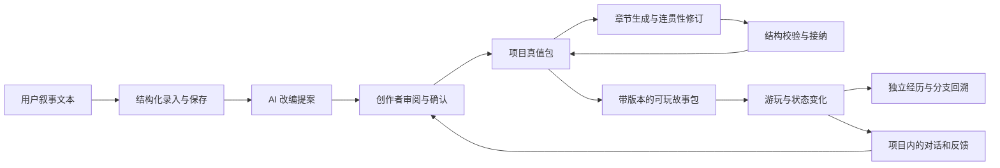

# Storybook 通用框架

这是实现导航。产品规则以 `.nimi/spec/storybook/canonical/*.authority.yaml` 为准。

Storybook 的对象是作者可自由组织的互动体验。Character Card V2、独立作品和世界资料可以组合使用；角色、世界、节点、选项、状态和结局都是作品数据，后四者并非每份作品的必备结构。内置内容不成为 Engine 或 AI 的条件分支。

当前互换协议与创作示例见 [Storybook 协议指南](storybook-protocol.md)。`StorybookProjectAuthority` 包含已有编排式故事真值包和导入体验真值包两种创作形式，不把章节批准流程强加给普通角色卡。

| 层 | 位置 | 职责 |
| --- | --- | --- |
| 作品内容 | `src/storybook/content/` | 可替换的内置作品与测试示例；不被 Engine 或 AI 调度导入 |
| 互换协议 | `src/storybook/engine/protocol/` | V2 原卡保留、独立作品与资源引用、模块校验、按需 lore 激活、确定性状态、类型化任务及经历快照 |
| Engine | `src/storybook/engine/` | 项目真值、批准与版本、结构化生成结果的接纳、引用和分支校验、状态变化、完整游玩会话及分支回溯事务 |
| AI 适配 | `src/storybook/ai/` | 根据当前项目的数据构建请求，通过 Nimi SDK 调用模型，解析输出并保留真实结果与失败原因 |
| 持久化 | `src/storybook/store/`、`src/shell/infra/storybook-file-storage.ts` | 项目、出版版本、运行、对话、回溯点及已采纳的创作偏好；限定在应用内部 |
| 产品界面 | `src/storybook/ui/` | 创作间、书架、阅读、即兴对话、故事线回溯与导入导出 |
| 平台连接 | `src/shell/` | Desktop 监督的会话、Nimi SDK 和 Runtime 所有的 App AIConfig |

创作路径不读取内置故事作为素材。新输入先保存原文，再产生待确认提案；批准后，生成器读取原文、该项目已确认的设定与已采纳的呈现偏好。生成与修订使用同一组通用字段，不按故事名称、角色姓名或示例 ID 分派逻辑。章节标识在接纳时生成，节点归属也在此时由 Engine 绑定。

书架从可玩包读取标题、简介、人物身份、场景与结局信息，不固定展示某个故事。出版版本保持独立，修改创作项目不会重写旧版本的游玩经历。回溯从实际选择之前的状态和对话记录创建新经历，原经历仍然保留。

AI 只通过受保护的 Nimi App Access 执行。模型选择由 Runtime 的 App AIConfig 管理。离线时可以阅读完整的已准备故事和保存草稿；需要 AI 的操作返回明确的不可用状态，不生成替代正文或占位成功结果。

编辑与异步操作按内容身份拥有生命周期：项目生成由 `storybook-project.ts` 协调，项目、作品、原文和待发对话由共享的 `content-editors.ts` 会话保存。离开页面不新建另一份写入者；生成完成时针对最新编辑状态接纳结果。若作者已修改方案，保留作者编辑，将实际生成的最终提案或章节留在创作记录中，供查看，不用旧快照覆盖新内容。执行中的请求仍依赖当前 App 进程，不是跨进程后台任务。

同一经历的生成、选择、角色切换、恢复和分叉经过 `storybook-experience.ts` 的统一操作入口，原生写入未完成时不能从旧记录发起另一次修改。原文提交作为一次受保护的交接，阻止重复提交；保存失败保留共享输入，成功后仅清理提交对应的草稿版本。内存中的工作副本用于保留待保存编辑，持久化仍只由原生文件接口完成。

## 当前已接通的产品范围

- 无 Storybook 扩展的 Character Card V2 JSON/PNG 导入、开场选择、真实互动与原始 JSON 导出。
- 独立作品的角色位置、可选世界资料、开放互动、局部分支反馈、版本保留与回溯。
- 在同一个工作定义中更换人物和世界；已开始的经历保留原有资源快照。
- 真实文本生成任务、声明式任务依赖、明确的媒体能力缺失与作者替代内容；协议从一开始使用类型化的多媒体输入／输出。
- 所有角色、作品、图像、项目、草稿和经历通过 Nimi Kit / SDK 原生文件存储持久保存，写入提交后才更新界面；PNG 媒体独立存储，导出作品时恢复为可携带的媒体内容。浏览器存储与内存降级不再是产品持久化路径。

- 通用短篇输入、AI 提案、人工确认、章节编排、连贯性修订、自然语言修改意见、试玩和出版。
- 对任意合法故事包的选择推进、状态变化、结局、继续阅读、版本保留及回溯。
- 受当前场景和已发生对话约束的 AI 即兴对话；它不会自动替玩家选择路线。
- 作品文件的真实导出、导入及无 AI 会话下的独立阅读。

当前生成器是有界的单章短篇适配器：界面接受最多 8000 字，生成结果校验接受 5–24 个场景和至少两个可达结局。这个限制属于当前生成工作流，不意味着引擎依赖某篇短篇或固定的章节 ID。

跨章节推进、长篇连续生成、把自由行动转成新的剧情结构、将自然语言世界规则完整编译为可执行机制，尚未全部接入产品路径。Engine 的确定性校验覆盖结构、引用、接纳、可达性和状态归属；AI 连贯性修订仍是创作辅助，不能替代作者对剧情逻辑的判断。

## 内容与验证的边界

`content/library.ts` 是编辑编写的内置内容；`content/example.ts` 是独立的测试用内容，均不是生成器模板。历史的占位序章生成器已经移除。`test/storybook-separation.test.mjs` 检查 Engine、AI 和普通 Play 不依赖样例身份或内容。通用行为测试使用多种作品与不同的项目、章节标识。

此前的文本改编迭代实际以两篇独立新文本完成了 Nimi 生成与提案确认，并实测自动连贯性修订、自然语言修改、即兴对话和完整游玩。其中一部还通过真实的故事包导出，在无受保护会话的阅读窗口中导入并玩到了结局。具体作品、测试请求和本机验收输出保存在 `.nimi/local/storybook-redesign/`，不作为产品权威或随应用发布的故事逻辑。

协议迭代的真实验收使用不同普通角色卡、独立作品和独立 lorebook，覆盖实际 Nimi 对话、角色／世界替换、选择反馈、回溯、任务生成和原文件导出。Mia 原卡通过文件选择器导入，并通过真实下载核对全部 JSON 字段及 20 条内嵌 lorebook；没有为其增加角色专用逻辑。具体本机产物在 `.nimi/local/protocol-iteration/`。工程检查和产品路径验收分别报告，未接入的多媒体生成功能不记为成功。
